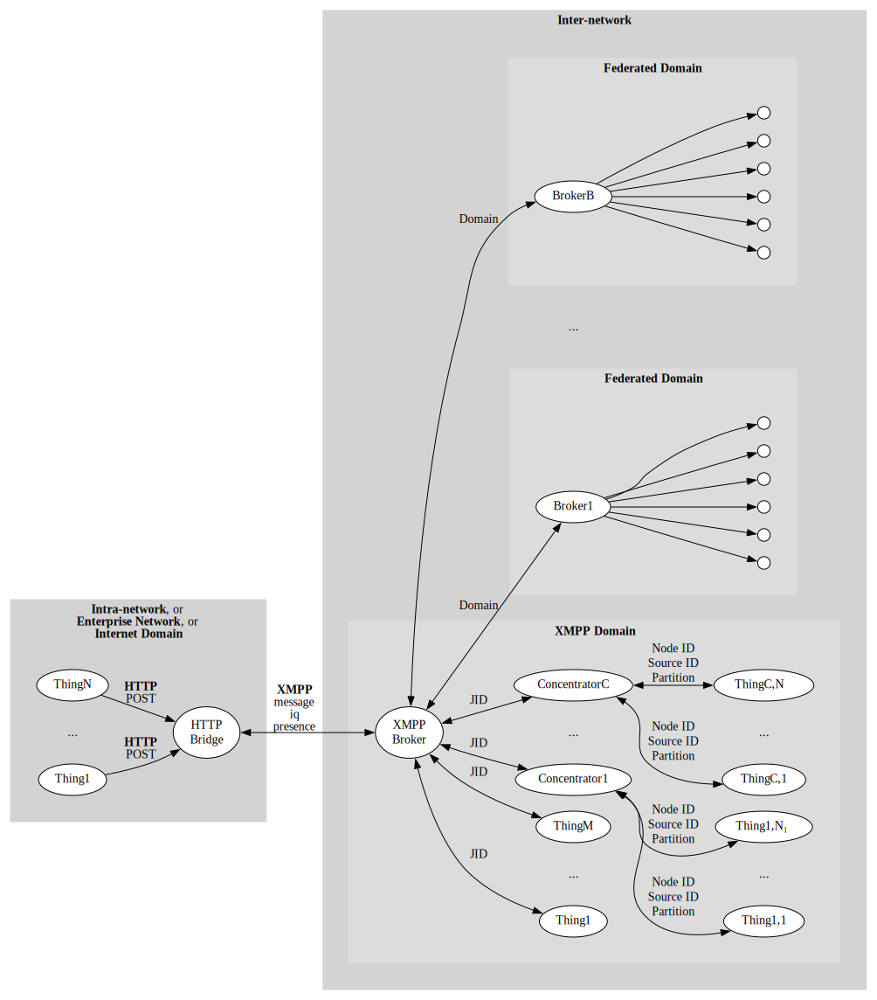

IoTBridgeHttp
================

Provides an IoT bridge between external devices that `POST` sensor data to the bridge using
HTTP, for use in closed intra-networks or enterprise networks, or the public Internet, and 
the harmonized XMPP-based [Neuro-Foundation](https://neuro-foundation.io/) network, for open 
and secure cross-domain interoperation on the Internet.



To run the bridge, you need access to an XMPP broker that supports the Neuro-Foundation extensions.
You can use the [TAG Neuron](https://lab.tagroot.io/Documentation/Neuron/InstallBroker.md) for 
XMPP.

Running and configuring the bridge
-------------------------------------

The code is written using .NET Standard, and compiled to a .NET Core console application
that can be run on most operating systems. Basic configuration is performed using the
console interface during the first execution, and persisted. You can also provide the
corresponding configuration using environment variables, making it possible to run the
bridge as a container. If an environmental variable is missing, the user will be prompted
to input the value on the console.

| Environmental Variable    | Type    | Description                                                                                                           |
|:--------------------------|:--------|:----------------------------------------------------------------------------------------------------------------------|
| `XMPP_HOST`               | String  | XMPP Host name                                                                                                        |
| `XMPP_PORT`				| Integer | Port number to use when connecting to XMPP (default is `5222`)                                                        |
| `XMPP_USERNAME`			| String  | User name to use when connecting to XMPP.                                                                             |
| `XMPP_PASSWORD`			| String  | Password (or hashed password) to use when connecting to XMPP. Empty string means a random password will be generated. |
| `XMPP_PASSWORDHASHMETHOD`	| String  | Algorithm or method used for password. Empty string means the password is provided in the clear.                      |
| `XMPP_APIKEY`				| String  | API Key. If provided together with secret, allows the application to create a new account.                            |
| `XMPP_APISECRET`			| String  | API Secret. If provided together with key, allows the application to create a new account.                            |
| `REGISTRY_COUNTRY`		| String  | Country where the bridge is installed.                                                                                |
| `REGISTRY_REGION`			| String  | Region where the bridge is installed.                                                                                 |
| `REGISTRY_CITY`			| String  | City where the bridge is installed.                                                                                   |
| `REGISTRY_AREA`			| String  | Area where the bridge is installed.                                                                                   |
| `REGISTRY_SRTEET`			| String  | Street where the bridge is installed.                                                                                 |
| `REGISTRY_STREETNR`		| String  | Street number where the bridge is installed.                                                                          |
| `REGISTRY_BUILDING`		| String  | Building where the bridge is installed.                                                                               |
| `REGISTRY_APARTMENT`		| String  | Apartment where the bridge is installed.                                                                              |
| `REGISTRY_ROOM`			| String  | Room where the bridge is installed.                                                                                   |
| `REGISTRY_NAME`			| String  | Name associated with bridge.                                                                                          |
| `REGISTRY_LOCATION`		| Boolean | If location has been completed. (This means, any location-specific environment variables not provided, will be interpreted as intensionally left blank, and user will not be prompted to input values for them. |
| `JWT_SECRET`              | String  | Secret used to create JWT tokens. If not provided, a random secret will be created.                                   |
| `X509_FILENAME`           | String  | File name to X.509 certificate to use. If not provided, HTTPS will not be enabled.                                    |
| `X509_PASSWORD`           | String  | Password to X.509 certificate.                                                                                        |
| `HTTP_PORT`               | Integer | Port number to use for unencrypted HTTP. (default is `80`)                                                            |
| `HTTPS_PORT`              | Integer | Port number to use for encrypted HTTPS. (default is `443`)                                                            |
| `ADMIN_NAME`              | String  | Administrator User name.                                                                                              |
| `ADMIN_PASSWORD`          | String  | Administrator Password.                                                                                               |
| `USER_COUNT`              | Integer | Number of users to create. (Default is `0`, which will trigger manual input of users.)                                |
| `USER_N_NAME`             | String  | User name for user `N`. (where `N` is a number between `1` and `USERS_COUNT`)                                         |
| `USER_N_PASSWORD`         | String  | Password for user `N`. (where `N` is a number between `1` and `USERS_COUNT`)                                          |
| `USER_N_PRIVILEGE`        | String  | Regular expression specifying the privilege or privileges held by the user. (Default is `Admin.SensorData.Post`.)     |

### Running in a Docker container

You can run the bridge in a Docker container. When doing so it is important to either configure all
settings via the environment variables, or to redirect `stdin` and allocate a `TTY`. You do this
using the `-it` switch to `docker run`. For example:

```bash
docker run -it iot-bridge-http
```

#### Setting up persistent storage

Persistent storage is required to store configuration, as well as data about the bridge, its nodes,
and ownerships, etc. You can do this by mapping the local folder `/var/lib/IoT Gateway` to a Volume
when creating the container.

#### Using an environment file

You can provide environment variables using an environment file. Create a new text file based on the
`IoTBridgeHttp.env` file in the repository. Set the values you want to provide, and then use the
`--env-file` switch when creating the container. For example:

```bash
docker run -it --env-file IoTBridgeHttp.env -v /my/local/folder:/var/lib/IoT\ Gateway iot-bridge-http
```

**Note**: If providing credentials, make sure the file is not accessible by others, and make sure it
is not checked in to any repository. An alternative to providing credentials in an environment file, 
is to enable standard and terminal input, and provide it via the prompt (see above).

Claiming ownership of bridge
-------------------------------

Once the bridge has been configured, it will generate an `iotdisco` URI, and save it to its
programd data folder. It will also create a file with extension `.url`, containing a shortcut
with the `iotdisco` URI inside. A `.png` file with a QR code will also be generated. All three
files contain information about the bridge, and allows the owner to claim ownership of it.
This can be done by using the [Neuro-Access App](https://github.com/Trust-Anchor-Group/NeuroAccessMaui).
This app is also downloadable for [Android](https://play.google.com/store/apps/details?id=com.tag.NeuroAccess) 
and [iOS](https://apps.apple.com/app/neuro-access/id6446863270). You scan the QR code (or
enter it manually), and claim the device. Once the device is claimed by you, you will receive
notifications when someone wants to access the deice. They will only be able to access it
with the owner's permission. For more information, see:

* [Registration, discovery & ownership process](https://neuro-foundation.io/Discovery.md)
* [Decision support for deviceos](https://neuro-foundation.io/DecisionSupport.md)
* [Provisioning for owners](https://neuro-foundation.io/Provisioning.md)


Configuring the bridge
-------------------------

The bridge can be configured in detail by a client that implements the [concentrator interface](https://neuro-foundation.io/Concentrator.md).
Concentrators consist of *data sources*, each containing tree structures of *nodes*. Nodes may be partitioned into
*partitions*, which permits the nesting of subsystems seamlessly into container systems. Each node can be
of different types, and have different properties and underlying functionality. They can each implement then
[sensor interface](https://neuro-foundation.io/SensorData.md) and [actuator interface](https://neuro-foundation.io/ControlParameters.md).

You can use the [Simple IoT Client](https://waher.se/IoTGateway/SimpleIoTClient.md) to configure concentrators and their nodes in detail.
An initial setup is done using the initial configuration of the bridge. The client is also available in the
[IoTGateway](https://github.com/Neuro-Foundation/IoTGateway) repository, in the
[Clients folder](https://github.com/Neuro-Foundation/IoTGateway/tree/master/Clients/Waher.Client.WPF).

Node Types
-------------

The bridge includes several different node types that can be used to configure its operation:

*	The `Local Web Server Node` represents the local web server in the gateway. This node hosts
	the web service that allows external devices to `POST` sensor data to the bridge. It also
	acts as the root node for the subtree of nodes representing devices that receive sensor
	data via HTTP `POST` requests.

*	The `XMPP Broker` maintains a connection to an XMPP Broker. It allows the bridge to connect
	to other entities on the federated network and communicate with them. It supports communication
	with remote standalone sensors and actuators, as well as remote concentrators embedding devices
	into data sources and nodes. Such concentrators can be bridges to other protocols and networks.
	
	**Note**: The bridge has a client-to-server connection by default, setup during initial
	configuration. Through this connection, the bridge acts as a concentrator. Through the use of
	`XMPP Broker` nodes you can setup additional XMPP connections to other brokers. In these cases
	the bridge will only act as a client, to connect to remove devices for the purposes of interacting
	with them.

*	`IP Host` nodes allow you to monitor network hosts accessible from the bridge.

*	`Script` nodes allow you to create nodes with custom script logic. They can be used to interface
	bespoke devices in the network accessible from the bridge, for example.

*	`Virtual` nodes are placeholders where external logic (or script logic) can aggregate information
	in a way that makes them accessible by others in the federated network.

API Reference
----------------

The local web service registers a series of web resources that external devices can use.
Following is a brief overview, with references for more details.

### Sensor Data Receptor 

The Sensor data receptor resource `/ReportSensorData` is used by external devices to `POST`
sensor data to the bridge. The device needs to authenticate with the bridge, before it can
be authorized to access this resource. The device can use different mechanisms to authenticate
itself with the bridge:

* Use of *Mutual TLS* (mTLS). This requires the bridge to be configured with a certificate.
* Use of `WWW-Authenticate` web login procedure.
* Use of JSON Web Tokens (JWT) Bearer tokens for authentication. This requires the device
to login first using the Login resource (see below).

For details on how the resource works, see the 
[Sensor Data Receptor API endpoint on `lab.tagroot.io`](https://lab.tagroot.io/ReportSensorData)
as an example. The same page can be viewed on the bridge, once it is up and running.

### Login resource

The Login resource `/Login` is used to login to the bridge. If successful, a `Bearer` JWT
token is returned. External devices need to login to the bridge before they can `POST` 
sensor data to it. A token is valid for *1 hour*. The external device needs to renew the
token by loggin in again, if accessing the bridge for a longer period of time.

Input payload is expected to be a JSON object of the following type.

```
{
	"UserName": Required(Str(PUserName)),
	"PasswordHash": Required(Str(PPasswordHash)),
	"Nonce": Required(Str(PNonce))
}
```

The response is a JSON object of the following type:

```
{
	"Ok": Required(Bool(POK)),
	"Message": Required(Str(PMessage)),
	"Token": Optional(Str(PToken))
}
```

See the [Web login procedure](https://lab.tagroot.io/Community/Post/Web_login_procedure)
article for more details on how to compute the password hash and nonce values, and use them
in the login process.

### Root folder resource

The Root folder resource `/`. If no specific resource above is referenced, the default is to
look for a file resource in the `Root` folder, and return it if found. This allows you to
host custom web content on the bridge.

Web Page
-----------

The root resource `/` makes a temporary redirection to `/Index.md`, which is the landing page
for the bridge. It contains basic information about the bridge, as well as a login-mechanism
to access the setup of the bridge. Once logged in, you can manually edit roles and users.

### Security

The HTTP bridge supports multiple levels of security:

*	Access to things published on the federated network is protected by provisioning.
	When the gateway starts, it generates an `iotdisco` URI, which can be used to claim ownership 
	of the device. Once claimed, the owner receives notifications when someone wants to access the 
	device, and can decide whether to allow access or not.

*	The bridge supports a set of users and roles, each defining a set of privileges. During
	first start, the initial users and roles are configured. This can be done either using
	environment variables, or by providing input on the console. An administrator user is created,
	which will have all privileges. Once the bridge is up and running, the administrator can login
	and configure existing users and roles, and create new ones.

*	A Web-Application Firewall (WAF) is included in the bridge. The administrator can configure
	the WAF to block or allow access to specific resources, based on application-level rules. This
	can be used to restrict access to certain pages (such as the administrative pages) to certain
	IPs, for instance, or rate-limit access to certain resources, such as sensor-data publication
	resrouces.
	
	The Web-Application Firewall is defined in the `WAF.xml` file. It is an XML file that needs
	to validate against the [`https://waher.se/Schema/WAF.xsd` namespace](https://waher.se/Schema/WAF.xsd).
	The default version restricts access to the administration pages to local area network IP
	addresses.
